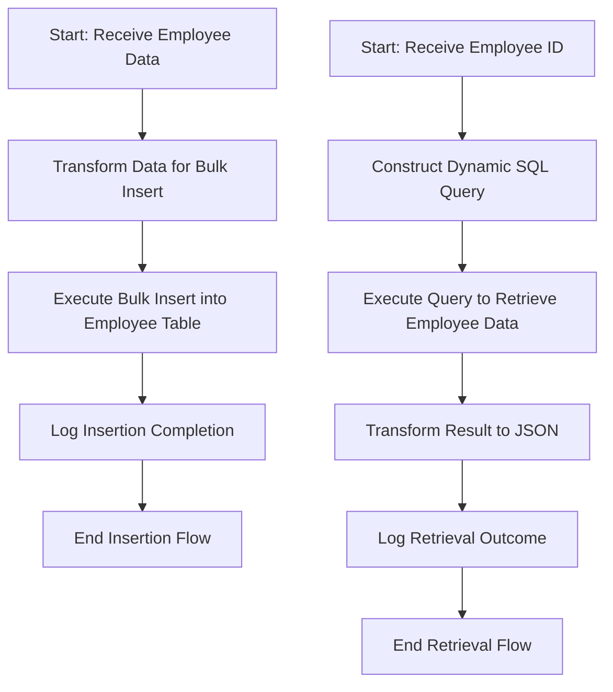

# Overview of Employee Integration Flows

Employee Integration Flows are responsible for managing employee data within the application. They enable key operations such as inserting new employee records into the database and retrieving existing employee information efficiently and reliably.

# Employee Data Insertion Flow

The insertion flow begins by transforming incoming employee data into a structured format optimized for bulk insertion into the database. This transformation maps essential fields including employee ID, national ID number, name, address details, phone number, gender, and birth date into a query and payload suitable for the database operation. After this preparation, the flow executes a bulk insert command to add multiple employee records simultaneously into the employee table, improving performance and consistency.

# Employee Data Retrieval Flow

The retrieval flow dynamically constructs a SQL query using an employee ID variable to fetch the corresponding employee record from the database. Once the query executes, the retrieved data is transformed into JSON format. This transformation ensures that the response either contains the employee's data or an empty object if no matching record is found, providing a clear and consistent API response.

# Logging and Monitoring

Both insertion and retrieval flows incorporate logging steps to facilitate monitoring and troubleshooting. The insertion flow logs an informational message upon successful completion of the data insertion. Similarly, the retrieval flow logs the name of the employee retrieved or a default message if no data is found, aiding in operational transparency.

# Example Implementation in <SwmPath>[src/…/mule/employee.xml](src/main/mule/employee.xml)</SwmPath>

In the file <SwmPath>[src/…/mule/employee.xml](src/main/mule/employee.xml)</SwmPath>, the `employeeInsert` flow demonstrates the insertion process by using a DataWeave transform to prepare a bulk insert SQL query and its parameters. It then performs the bulk insert using the database connector. The `employeeGet` flow constructs a select query based on the employee ID variable, executes the query, transforms the result into JSON, and logs the outcome. This file serves as a practical reference for how these integration flows are implemented within the application.

&nbsp;

*This is an auto-generated document by Swimm 🌊 and has not yet been verified by a human*

<SwmMeta version="3.0.0" repo-id="Z2l0aHViJTNBJTNBbXVsZS1kZW1vLWRhdGFiYXNlLWFwcCUzQSUzQXVtYWxpbmdhc3dhbWk=" repo-name="mule-demo-database-app">Powered by [Swimm](https://app.swimm.io/)</SwmMeta>
