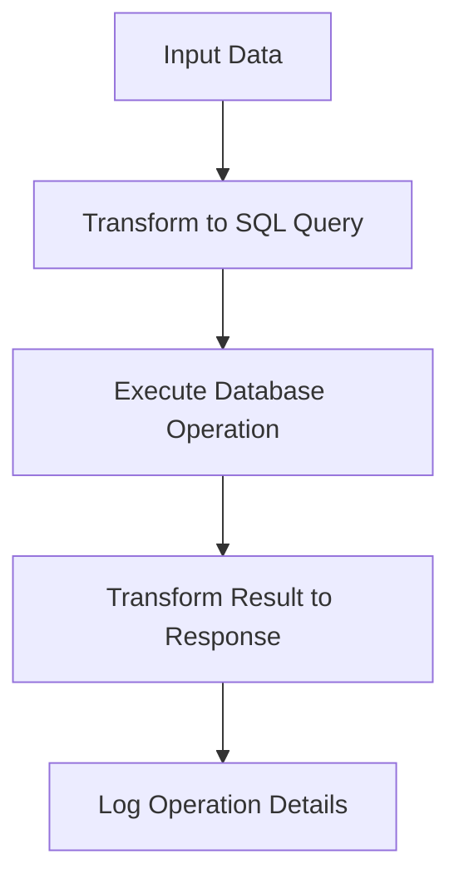

# Overview of Employee Management Integration Flows

Employee Management Integration Flows are designed to process and manipulate employee data through a sequence of connected steps. These flows orchestrate the transformation of incoming data into database queries and execute those queries to interact with the employee database efficiently.

# Purpose and Benefits of Integration Flows

Integration Flows provide modular and reusable pipelines that simplify complex data operations. By defining clear sequences of actions such as data transformation and database interaction, they enhance maintainability and clarity within the application.

# Structure and Components of Integration Flows

Each Integration Flow is defined with a unique name and includes components like transformers and connectors. Transformers convert input data into the required format or SQL queries, while connectors perform operations such as bulk inserts or selects on the database. Logging components are also integrated to provide operational feedback.

# Example: Employee Data Insertion Flow

The 'employeeInsert' flow demonstrates how a list of employee objects is transformed into a structured SQL insert statement. This statement is then executed as a bulk insert into the employee database table. After the operation, a log message confirms the successful completion of the insert.

# Example: Employee Data Retrieval Flow

Similarly, the 'employeeGet' flow constructs a SQL select query based on an employee ID input variable. It executes the query, transforms the result into a JSON response, and logs the retrieved employee's name to provide informational feedback.

# Data Flow in Employee Management Integration Flows

The data flow begins with receiving input data, which is then transformed into SQL queries by transformers. These queries are executed against the employee database using database connectors. The results are subsequently transformed into appropriate response formats, and logging captures key operation details throughout the process.

&nbsp;

*This is an auto-generated document by Swimm 🌊 and has not yet been verified by a human*

<SwmMeta version="3.0.0" repo-id="Z2l0aHViJTNBJTNBbXVsZS1kZW1vLWRhdGFiYXNlLWFwcCUzQSUzQXVtYWxpbmdhc3dhbWk=" repo-name="mule-demo-database-app">Powered by [Swimm](https://app.swimm.io/)</SwmMeta>
