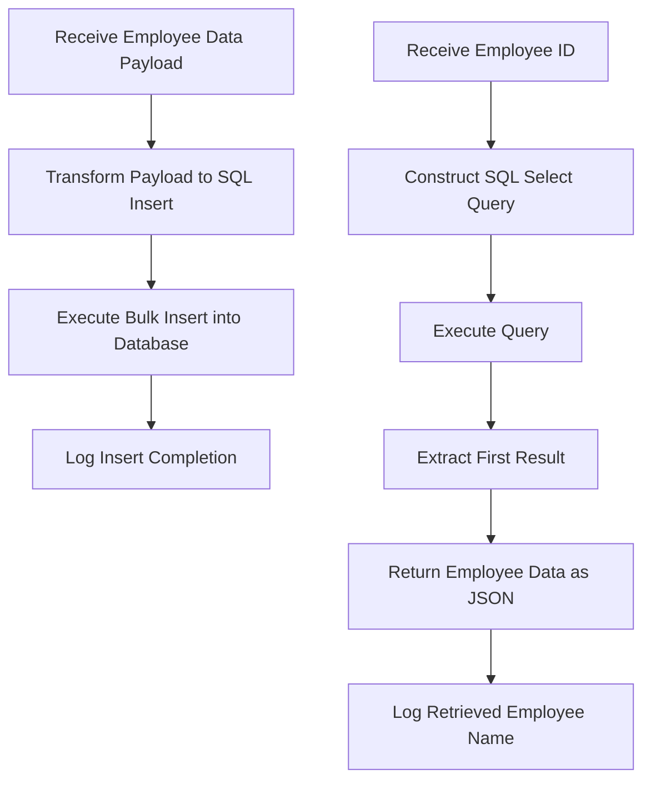

# Employee Management Overview

Employee Management in this repository encompasses the flows and logic designed to manage employee data operations, specifically the insertion of new employee records and the retrieval of existing employee details from the database.

# Core Flows for Employee Management

There are two primary flows responsible for handling employee data: <SwmToken path="src/main/mule/employee.xml" pos="10:7:7" line-data="	&lt;flow name=&quot;employeeInsert&quot; doc:id=&quot;5265fa9b-6f54-4f7c-8cdd-87642ee588b0&quot; &gt;">`employeeInsert`</SwmToken> and <SwmToken path="src/main/mule/employee.xml" pos="41:7:7" line-data="	&lt;flow name=&quot;employeeGet&quot; doc:id=&quot;8380dba3-0eb4-4aa9-bfb4-182e8cc8a689&quot; &gt;">`employeeGet`</SwmToken>. The <SwmToken path="src/main/mule/employee.xml" pos="10:7:7" line-data="	&lt;flow name=&quot;employeeInsert&quot; doc:id=&quot;5265fa9b-6f54-4f7c-8cdd-87642ee588b0&quot; &gt;">`employeeInsert`</SwmToken> flow facilitates bulk insertion of multiple employee records by transforming incoming data payloads into SQL insert statements and executing them efficiently. Conversely, the <SwmToken path="src/main/mule/employee.xml" pos="41:7:7" line-data="	&lt;flow name=&quot;employeeGet&quot; doc:id=&quot;8380dba3-0eb4-4aa9-bfb4-182e8cc8a689&quot; &gt;">`employeeGet`</SwmToken> flow retrieves employee information based on a provided employee ID by dynamically constructing and executing a SQL select query, returning the first matching record.

# Data Transformation and Database Operations

Both flows utilize MuleSoft's DataWeave transformations to map and format the data payloads appropriately for database interactions. In the <SwmToken path="src/main/mule/employee.xml" pos="10:7:7" line-data="	&lt;flow name=&quot;employeeInsert&quot; doc:id=&quot;5265fa9b-6f54-4f7c-8cdd-87642ee588b0&quot; &gt;">`employeeInsert`</SwmToken> flow, the incoming payload is transformed into a SQL insert query with parameters corresponding to each employee attribute such as <SwmToken path="src/main/mule/employee.xml" pos="17:12:12" line-data="	query: &quot;insert into employee (empId,nationalIDNumber,eName,addressLn,addressCity,addressZIP,addressState,addressCountry,phone,gender,birthDate) ">`empId`</SwmToken>, <SwmToken path="src/main/mule/employee.xml" pos="17:14:14" line-data="	query: &quot;insert into employee (empId,nationalIDNumber,eName,addressLn,addressCity,addressZIP,addressState,addressCountry,phone,gender,birthDate) ">`nationalIDNumber`</SwmToken>, and <SwmToken path="src/main/mule/employee.xml" pos="17:16:16" line-data="	query: &quot;insert into employee (empId,nationalIDNumber,eName,addressLn,addressCity,addressZIP,addressState,addressCountry,phone,gender,birthDate) ">`eName`</SwmToken>. This transformed payload is then used in a bulk insert operation to add multiple employee records in a single transaction. In the <SwmToken path="src/main/mule/employee.xml" pos="41:7:7" line-data="	&lt;flow name=&quot;employeeGet&quot; doc:id=&quot;8380dba3-0eb4-4aa9-bfb4-182e8cc8a689&quot; &gt;">`employeeGet`</SwmToken> flow, the employee ID input is appended to a SQL select query string, which is executed to fetch the relevant employee record.

# Logging and Monitoring

After database operations, logging is incorporated to provide informational messages. For example, the <SwmToken path="src/main/mule/employee.xml" pos="10:7:7" line-data="	&lt;flow name=&quot;employeeInsert&quot; doc:id=&quot;5265fa9b-6f54-4f7c-8cdd-87642ee588b0&quot; &gt;">`employeeInsert`</SwmToken> flow logs the completion of the bulk insert process, while the <SwmToken path="src/main/mule/employee.xml" pos="41:7:7" line-data="	&lt;flow name=&quot;employeeGet&quot; doc:id=&quot;8380dba3-0eb4-4aa9-bfb4-182e8cc8a689&quot; &gt;">`employeeGet`</SwmToken> flow logs the name of the retrieved employee. This logging aids in monitoring the flow executions and troubleshooting if necessary.

# Location of Employee Management Flows

These flows are implemented within the <SwmPath>[src/…/mule/employee.xml](src/main/mule/employee.xml)</SwmPath> file. Specifically, the <SwmToken path="src/main/mule/employee.xml" pos="10:7:7" line-data="	&lt;flow name=&quot;employeeInsert&quot; doc:id=&quot;5265fa9b-6f54-4f7c-8cdd-87642ee588b0&quot; &gt;">`employeeInsert`</SwmToken> flow spans lines 10 to 40, where the payload transformation and bulk insert logic reside. The <SwmToken path="src/main/mule/employee.xml" pos="41:7:7" line-data="	&lt;flow name=&quot;employeeGet&quot; doc:id=&quot;8380dba3-0eb4-4aa9-bfb4-182e8cc8a689&quot; &gt;">`employeeGet`</SwmToken> flow is defined from lines 41 to 62, handling the dynamic SQL query construction and retrieval of employee data.

<SwmSnippet path="/src/main/mule/employee.xml" line="10">

---

The <SwmToken path="src/main/mule/employee.xml" pos="10:7:7" line-data="	&lt;flow name=&quot;employeeInsert&quot; doc:id=&quot;5265fa9b-6f54-4f7c-8cdd-87642ee588b0&quot; &gt;">`employeeInsert`</SwmToken> flow begins by receiving a payload containing multiple employee records. It uses DataWeave to transform this payload into a SQL insert statement with mapped parameters for each employee field. This transformation enables the database connector to perform a bulk insert operation efficiently, inserting all employee records in one batch. Upon successful insertion, a logger records an informational message indicating the completion of the insert process.

```xml
	<flow name="employeeInsert" doc:id="5265fa9b-6f54-4f7c-8cdd-87642ee588b0" >
		<ee:transform doc:name="Transform Message" doc:id="d40b196b-fa52-4bc6-81b3-cbd838baf0ff" >
			<ee:message >
				<ee:set-payload ><![CDATA[%dw 2.0
output application/json
---
{
	query: "insert into employee (empId,nationalIDNumber,eName,addressLn,addressCity,addressZIP,addressState,addressCountry,phone,gender,birthDate) 
			values (:empId,:nationalIDNumber,:eName,:addressLn,:addressCity,:addressZIP,:addressState,:addressCountry,:phone,:gender,:birthDate)",
	body: payload map ( payload01 , indexOfPayload01 ) -> {
			empId: payload01.empId,
			nationalIDNumber: payload01.nationalIDNumber,
			eName: payload01.eName,
			addressLn: payload01.addressLn,
			addressCity: payload01.addressCity,
			addressZIP: payload01.addressZIP,
			addressState: payload01.addressState,
			addressCountry: payload01.addressCountry,
			phone: payload01.phone,
			gender: payload01.gender,
			birthDate: payload01.birthDate
	}
}]]></ee:set-payload>
			</ee:message>
		</ee:transform>
		<db:bulk-insert doc:name="Bulk insert" doc:id="0736fde4-aff5-405d-8d34-bd40f644baec" config-ref="Database_Config">
			<db:bulk-input-parameters ><![CDATA[#[payload.body]]]></db:bulk-input-parameters>
			<db:sql ><![CDATA[#[payload.query]]]></db:sql>
		</db:bulk-insert>
		<logger level="INFO" doc:name="Logger" doc:id="c30da949-db08-471a-bc57-65d9b5b7dcf2" message="Insert of Data Complete"/>
	</flow>
```

---

</SwmSnippet>

<SwmSnippet path="/src/main/mule/employee.xml" line="41">

---

The <SwmToken path="src/main/mule/employee.xml" pos="41:7:7" line-data="	&lt;flow name=&quot;employeeGet&quot; doc:id=&quot;8380dba3-0eb4-4aa9-bfb4-182e8cc8a689&quot; &gt;">`employeeGet`</SwmToken> flow accepts an employee ID as input and constructs a SQL select query dynamically by appending this ID to the query string. It executes the query to fetch the employee record matching the ID. The flow then extracts the first result from the query response and returns it as a JSON object. Additionally, a logger outputs the name of the retrieved employee to provide visibility into the operation.

```xml
	<flow name="employeeGet" doc:id="8380dba3-0eb4-4aa9-bfb4-182e8cc8a689" >
		<ee:transform doc:name="Transform Message" doc:id="61716d39-89f2-41b8-9b18-17f8945a2b76" >
			<ee:message >
				<ee:set-payload ><![CDATA[%dw 2.0
output application/java
---
"select * from employee where empId = '" ++ vars.empId ++ "'"]]></ee:set-payload>
			</ee:message>
		</ee:transform>
		<db:select doc:name="Select" doc:id="9ef1e38a-e8d5-4740-9798-05e6634a852f" config-ref="Database_Config">
			<db:sql ><![CDATA[#[payload]]]></db:sql>
		</db:select>
		<ee:transform doc:name="Transform Message" doc:id="9d48be5a-7a19-4adc-b4b6-e53e65ce7d21" >
			<ee:message >
				<ee:set-payload ><![CDATA[%dw 2.0
output application/json
---
payload[0] default {}]]></ee:set-payload>
			</ee:message>
		</ee:transform>
		<logger level="INFO" doc:name="Logger" doc:id="935042a6-83b8-4ba6-9723-e61bd61ce515" message='#["Got Data for " ++ (payload.eName default "None")]'/>
	</flow>
```

---

</SwmSnippet>

# Summary of Employee Management Data Flow

In summary, the Employee Management flows automate the process of adding and retrieving employee data by leveraging DataWeave transformations and database connectors. The <SwmToken path="src/main/mule/employee.xml" pos="10:7:7" line-data="	&lt;flow name=&quot;employeeInsert&quot; doc:id=&quot;5265fa9b-6f54-4f7c-8cdd-87642ee588b0&quot; &gt;">`employeeInsert`</SwmToken> flow efficiently handles bulk inserts, while the <SwmToken path="src/main/mule/employee.xml" pos="41:7:7" line-data="	&lt;flow name=&quot;employeeGet&quot; doc:id=&quot;8380dba3-0eb4-4aa9-bfb4-182e8cc8a689&quot; &gt;">`employeeGet`</SwmToken> flow enables targeted retrieval of employee details. Logging throughout these flows ensures operational transparency.



&nbsp;

*This is an auto-generated document by Swimm 🌊 and has not yet been verified by a human*

<SwmMeta version="3.0.0" repo-id="Z2l0aHViJTNBJTNBbXVsZS1kZW1vLWRhdGFiYXNlLWFwcCUzQSUzQXVtYWxpbmdhc3dhbWk=" repo-name="mule-demo-database-app"><sup>Powered by [Swimm](https://app.swimm.io/)</sup></SwmMeta>
