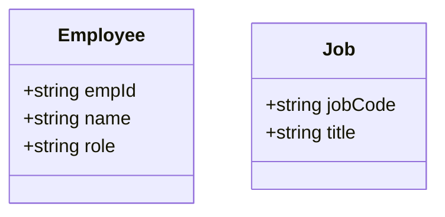
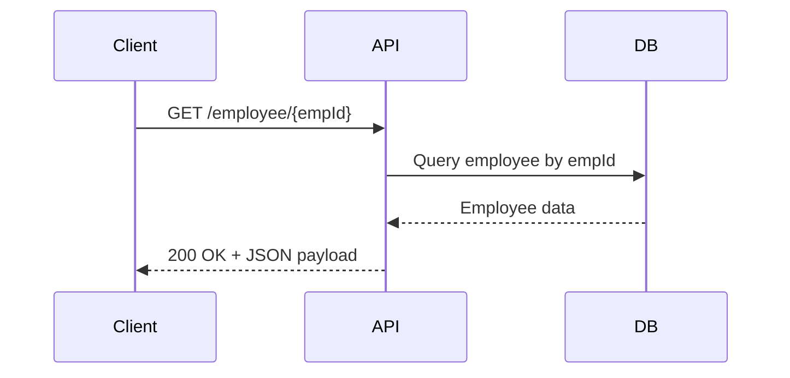

# explain about this document

This document describes the business rules, use cases, and integration requirements for an employee and job management API. The API supports retrieving and inserting employee and job data. It handles common HTTP errors with clear JSON messages and standard status codes. The goal is to provide a clear understanding of how the API behaves from a business perspective, without technical jargon.

We will cover:

1. What are the main use cases supported by the API?
2. How does the API handle error conditions and responses?
3. What are the business rules governing employee and job data management?
4. What validation rules ensure data integrity?
5. What integration points exist for external communication?
6. How do use cases depend on each other and on business entities?

# introduction

| Aspect           | Description                                                                                      |
| ---------------- | ------------------------------------------------------------------------------------------------ |
| Application      | Employee and job management API                                                                  |
| Business context | Manage employee and job records via RESTful endpoints                                            |
| Objectives       | Provide endpoints to retrieve and insert employee and job data; handle errors with JSON messages |

# UC-001 | Retrieve employee details

| Description    | Allows retrieval of employee details by employee ID. |
| -------------- | ---------------------------------------------------- |
| Primary Actor  | API consumer (e.g., HR system, internal tools)       |
| Preconditions  | Employee with given ID exists in the system.         |
| Postconditions | Employee details are returned in JSON format.        |

### Basic flow

| Step | User Actions                   | System Actions                                        |
| ---- | ------------------------------ | ----------------------------------------------------- |
| 1    | Request employee details by ID | Extract employee ID from URL and fetch employee data  |
| 2    |                                | Return employee data as JSON response with status 200 |

### Alternate flow

None defined.

### Exception flow

| Step | User Actions                                        | System Actions                                         |
| ---- | --------------------------------------------------- | ------------------------------------------------------ |
| 1    | Request employee details with invalid or missing ID | Return 400 Bad Request with message "Bad request"      |
| 2    | Request employee details for non-existent ID        | Return 404 Not Found with message "Resource not found" |

### Business rules

| Rule ID | Description                                        |
| ------- | -------------------------------------------------- |
| BR-001  | Employee IDs are unique identifiers for employees. |
| BR-002  | Only existing employees can be retrieved.          |

### Validation rules

| Rule ID | Description                                                                              |
| ------- | ---------------------------------------------------------------------------------------- |
| VR-001  | Employee ID must be present in the request URL.                                          |
| VR-002  | Employee ID must be a valid format (e.g., numeric or alphanumeric as per system design). |

### Entities and data model

| Entity   | Attributes                 | Relationships | Validation rules             | Error messages                      |
| -------- | -------------------------- | ------------- | ---------------------------- | ----------------------------------- |
| Employee | empId (unique), name, role | None          | empId required, valid format | "Bad request", "Resource not found" |

### Validation and testing

| Acceptance criteria                       | Test scenarios                          | Edge cases                   | Validation rules tested | Sample test data     |
| ----------------------------------------- | --------------------------------------- | ---------------------------- | ----------------------- | -------------------- |
| Employee details returned for valid empId | Request with valid empId                | empId missing, empId invalid | VR-001, VR-002          | empId=123, empId=abc |
| 400 returned for invalid requests         | Request with missing or malformed empId |                              |                         |                      |
| 404 returned for non-existent empId       | Request with empId not in system        |                              |                         | empId=999            |

# UC-002 | Insert new employee

| Description    | Allows insertion of a new employee record with JSON payload. |
| -------------- | ------------------------------------------------------------ |
| Primary Actor  | API consumer (e.g., HR system, internal tools)               |
| Preconditions  | Employee data payload is provided in JSON format.            |
| Postconditions | New employee record is created; success status returned.     |

### Basic flow

| Step | User Actions                     | System Actions                         |
| ---- | -------------------------------- | -------------------------------------- |
| 1    | Submit new employee data in JSON | Validate and insert employee record    |
| 2    |                                  | Return success message with status 200 |

### Alternate flow

None defined.

### Exception flow

| Step | User Actions                               | System Actions                                    |
| ---- | ------------------------------------------ | ------------------------------------------------- |
| 1    | Submit invalid or incomplete employee data | Return 400 Bad Request with message "Bad request" |

### Business rules

| Rule ID | Description                                            |
| ------- | ------------------------------------------------------ |
| BR-003  | New employees must have unique employee IDs.           |
| BR-004  | Successful insertion returns a success status message. |

### Validation rules

| Rule ID | Description                                              |
| ------- | -------------------------------------------------------- |
| VR-003  | Employee data must be valid JSON.                        |
| VR-004  | Required employee fields must be present in the payload. |

### Entities and data model

| Entity   | Attributes                 | Relationships | Validation rules                           | Error messages |
| -------- | -------------------------- | ------------- | ------------------------------------------ | -------------- |
| Employee | empId (unique), name, role | None          | empId required, unique, valid JSON payload | "Bad request"  |

### Validation and testing

| Acceptance criteria            | Test scenarios             | Edge cases                   | Validation rules tested | Sample test data           |
| ------------------------------ | -------------------------- | ---------------------------- | ----------------------- | -------------------------- |
| Employee inserted successfully | Submit valid employee JSON | Missing fields, invalid JSON | VR-003, VR-004          | {"empId":"123","name":"A"} |

# UC-003 | Retrieve job details

| Description    | Allows retrieval of job details by job code.   |
| -------------- | ---------------------------------------------- |
| Primary Actor  | API consumer (e.g., HR system, internal tools) |
| Preconditions  | Job with given code exists in the system.      |
| Postconditions | Job details are returned in JSON format.       |

### Basic flow

| Step | User Actions                    | System Actions                                   |
| ---- | ------------------------------- | ------------------------------------------------ |
| 1    | Request job details by job code | Extract job code from URL and fetch job data     |
| 2    |                                 | Return job data as JSON response with status 200 |

### Alternate flow

None defined.

### Exception flow

| Step | User Actions                                         | System Actions                                         |
| ---- | ---------------------------------------------------- | ------------------------------------------------------ |
| 1    | Request job details with invalid or missing job code | Return 400 Bad Request with message "Bad request"      |
| 2    | Request job details for non-existent job code        | Return 404 Not Found with message "Resource not found" |

### Business rules

| Rule ID | Description                              |
| ------- | ---------------------------------------- |
| BR-005  | Job codes uniquely identify job records. |
| BR-006  | Only existing jobs can be retrieved.     |

### Validation rules

| Rule ID | Description                                  |
| ------- | -------------------------------------------- |
| VR-005  | Job code must be present in the request URL. |
| VR-006  | Job code must be a valid format.             |

### Entities and data model

| Entity | Attributes              | Relationships | Validation rules               | Error messages                      |
| ------ | ----------------------- | ------------- | ------------------------------ | ----------------------------------- |
| Job    | jobCode (unique), title | None          | jobCode required, valid format | "Bad request", "Resource not found" |

### Validation and testing

| Acceptance criteria                    | Test scenarios                            | Edge cases                       | Validation rules tested | Sample test data |
| -------------------------------------- | ----------------------------------------- | -------------------------------- | ----------------------- | ---------------- |
| Job details returned for valid jobCode | Request with valid jobCode                | jobCode missing, jobCode invalid | VR-005, VR-006          | jobCode=DEV01    |
| 400 returned for invalid requests      | Request with missing or malformed jobCode |                                  |                         |                  |
| 404 returned for non-existent jobCode  | Request with jobCode not in system        |                                  |                         | jobCode=UNKNOWN  |

# UC-004 | Insert new job

| Description    | Allows insertion of a new job record with JSON payload. |
| -------------- | ------------------------------------------------------- |
| Primary Actor  | API consumer (e.g., HR system, internal tools)          |
| Preconditions  | Job data payload is provided in JSON format.            |
| Postconditions | New job record is created; success status returned.     |

### Basic flow

| Step | User Actions                | System Actions                         |
| ---- | --------------------------- | -------------------------------------- |
| 1    | Submit new job data in JSON | Validate and insert job record         |
| 2    |                             | Return success message with status 200 |

### Alternate flow

None defined.

### Exception flow

| Step | User Actions                          | System Actions                                    |
| ---- | ------------------------------------- | ------------------------------------------------- |
| 1    | Submit invalid or incomplete job data | Return 400 Bad Request with message "Bad request" |

### Business rules

| Rule ID | Description                                            |
| ------- | ------------------------------------------------------ |
| BR-007  | New jobs must have unique job codes.                   |
| BR-008  | Successful insertion returns a success status message. |

### Validation rules

| Rule ID | Description                                         |
| ------- | --------------------------------------------------- |
| VR-007  | Job data must be valid JSON.                        |
| VR-008  | Required job fields must be present in the payload. |

### Entities and data model

| Entity | Attributes              | Relationships | Validation rules                             | Error messages |
| ------ | ----------------------- | ------------- | -------------------------------------------- | -------------- |
| Job    | jobCode (unique), title | None          | jobCode required, unique, valid JSON payload | "Bad request"  |

### Validation and testing

| Acceptance criteria       | Test scenarios        | Edge cases                   | Validation rules tested | Sample test data                  |
| ------------------------- | --------------------- | ---------------------------- | ----------------------- | --------------------------------- |
| Job inserted successfully | Submit valid job JSON | Missing fields, invalid JSON | VR-007, VR-008          | {"jobCode":"DEV01","title":"Dev"} |

# integration requirements

| Integration Aspect       | Description                                                                                  |
| ------------------------ | -------------------------------------------------------------------------------------------- |
| APIs                     | RESTful endpoints for employee and job retrieval and insertion                               |
| Data exchange formats    | JSON for request and response payloads                                                       |
| Protocols                | HTTP with standard status codes (200, 400, 404, 405, 406, 415, 501)                          |
| Communication mechanisms | HTTP listener for API requests; error handling returns JSON messages with appropriate status |

# use case dependencies

|                           | Retrieve employee details | Insert new employee | Retrieve job details | Insert new job |
| :-----------------------: | :-----------------------: | :-----------------: | :------------------: | :------------: |
| Retrieve employee details |             X             |                     |                      |                |
|    Insert new employee    |                           |          X          |                      |                |
|    Retrieve job details   |                           |                     |           X          |                |
|       Insert new job      |                           |                     |                      |        X       |

# use case to entity dependencies

|                           | Employee | Job |
| :-----------------------: | :------: | :-: |
| Retrieve employee details |     X    |     |
|    Insert new employee    |     X    |     |
|    Retrieve job details   |          |  X  |
|       Insert new job      |          |  X  |

# diagrams





```mermaid
flowchart TD
    A[Start] --> B{Request type}
    B -->|GET /employee/{empId}| C[Retrieve employee]
    B -->|POST /employee| D[Insert employee]
    B -->|GET /job/{jobCode}| E[Retrieve job]
    B -->|POST /job| F[Insert job]
    C --> G[Return employee data]
    D --> H[Return success message]
    E --> I[Return job data]
    F --> J[Return success message]
    G --> K[End]
    H --> K
    I --> K
    J --> K
```

<SwmMeta version="3.0.0" repo-id="Z2l0aHViJTNBJTNBbXVsZS1kZW1vLWRhdGFiYXNlLWFwcCUzQSUzQXVtYWxpbmdhc3dhbWk=" repo-name="mule-demo-database-app"><sup>Powered by [Swimm](https://app.swimm.io/)</sup></SwmMeta>
