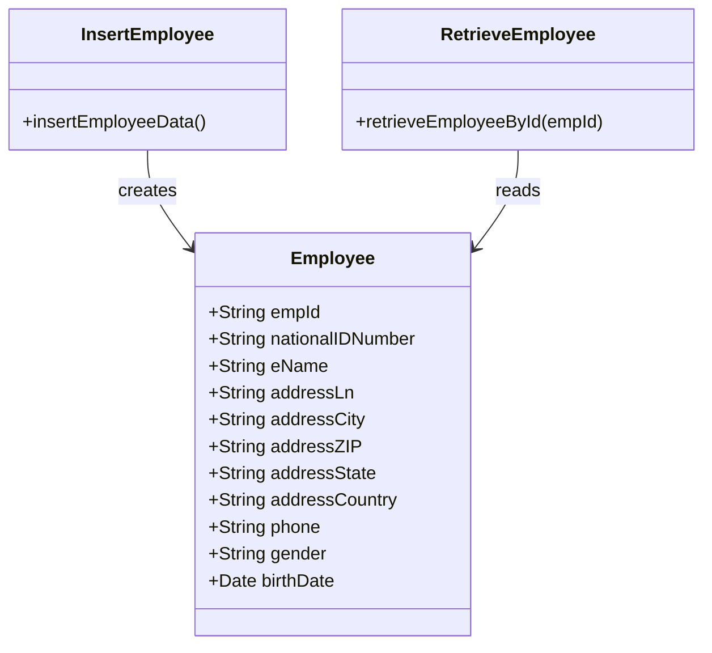
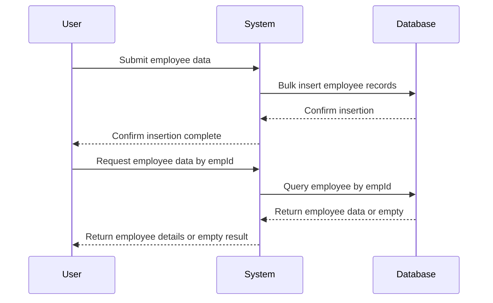
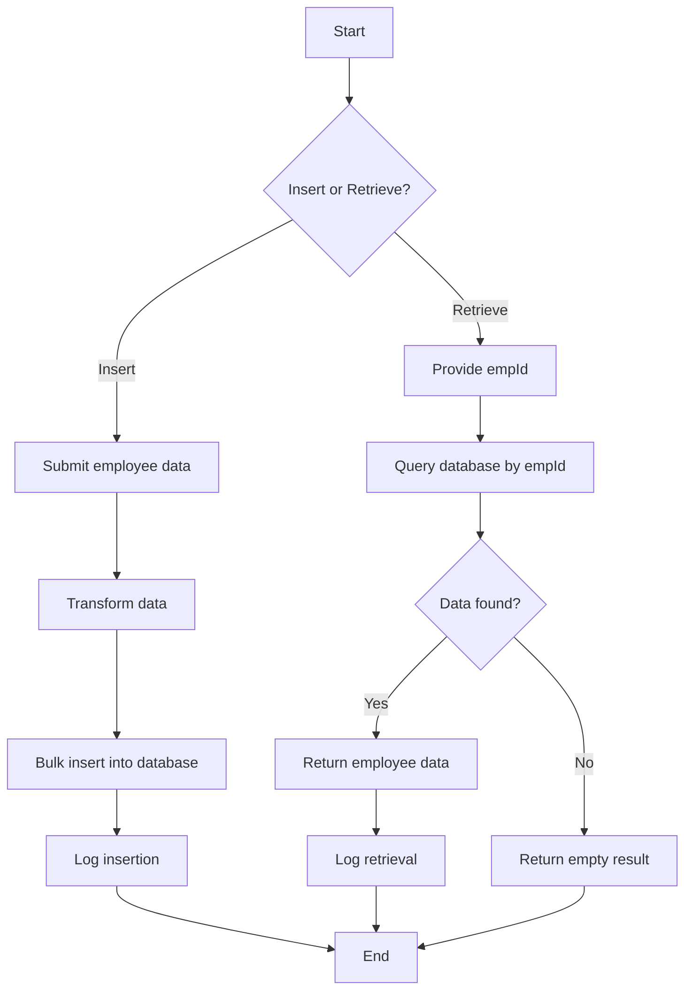

# explain about this document

This document describes the employee management capabilities of the application. It covers how employee data is inserted and retrieved, focusing on business rules, flows, and validation relevant to non-technical stakeholders. The goal is to clarify what the system does with employee information and how users interact with it.

We will cover:

1. How employee data is added to the system.
2. How employee data is retrieved by employee ID.
3. The business rules governing these operations.
4. Validation rules ensuring data correctness.
5. Entities involved and their attributes.
6. Integration points with external systems.
7. Dependencies between use cases.

# introduction

| Aspect              | Description                                                                                    |
| ------------------- | ---------------------------------------------------------------------------------------------- |
| Application purpose | Manage employee records by allowing insertion of new employees and retrieval of existing ones. |
| Business context    | Supports HR and administrative functions requiring employee data storage and lookup.           |
| Objectives          | Provide reliable insertion of employee data and quick retrieval by employee ID.                |

# UC-001 | Insert employee data

| Description    | Allows authorized users to add one or more employee records into the system. |
| -------------- | ---------------------------------------------------------------------------- |
| Primary Actor  | HR personnel, System administrators                                          |
| Preconditions  | Employee data to be inserted is available and formatted correctly.           |
| Postconditions | Employee records are stored and available for future retrieval.              |

## basic flow

| Step | User Actions                       | System Actions                             |
| ---- | ---------------------------------- | ------------------------------------------ |
| 1    | Submit employee data for insertion | Transform data into database insert format |
| 2    |                                    | Perform bulk insert of employee records    |
| 3    |                                    | Log completion of data insertion           |

## alternate flow

| Step | User Actions                 | System Actions                                                         |
| ---- | ---------------------------- | ---------------------------------------------------------------------- |
| 1    | Submit partial employee data | System inserts available records, skips incomplete ones (if supported) |

## exception flow

| Step | User Actions                                      | System Actions                          |
| ---- | ------------------------------------------------- | --------------------------------------- |
| 1    | Submit employee data with missing required fields | Reject insertion, return error message  |
| 2    | Submit employee data with duplicate empId         | Reject insertion, return conflict error |

## business rules

| Rule ID | Description                                                                                     |
| ------- | ----------------------------------------------------------------------------------------------- |
| BR-001  | Each employee must have a unique employee ID (empId).                                           |
| BR-002  | Employee records include personal and contact details such as name, address, phone, and gender. |
| BR-003  | Bulk insertion of multiple employee records is supported to optimize data entry.                |

## validation rules

| Rule ID | Description                                                         |
| ------- | ------------------------------------------------------------------- |
| VR-001  | empId must be present and unique.                                   |
| VR-002  | birthDate must be a valid date.                                     |
| VR-003  | phone number must follow the accepted format.                       |
| VR-004  | Required fields (empId, eName, nationalIDNumber) must not be empty. |

## entities and data model

| Entity   | Attributes                                                                                                                 | Description                                              |
| -------- | -------------------------------------------------------------------------------------------------------------------------- | -------------------------------------------------------- |
| Employee | empId, nationalIDNumber, eName, addressLn, addressCity, addressZIP, addressState, addressCountry, phone, gender, birthDate | Represents an employee with personal and contact details |

## validation and testing

| Test Scenario                        | Expected Result                                              | Test Data Example                          |
| ------------------------------------ | ------------------------------------------------------------ | ------------------------------------------ |
| Insert valid employee record         | Employee data stored successfully                            | empId=123, eName=John Doe, valid birthDate |
| Insert employee with missing empId   | Insertion rejected with error                                | empId=null                                 |
| Insert employee with duplicate empId | Insertion rejected due to conflict                           | empId=123 (already exists)                 |
| Insert multiple employees in bulk    | All valid records inserted, errors reported for invalid ones | List of employee objects                   |

# UC-002 | Retrieve employee data by ID

| Description    | Allows users to retrieve details of a specific employee by providing their employee ID. |
| -------------- | --------------------------------------------------------------------------------------- |
| Primary Actor  | HR personnel, System users                                                              |
| Preconditions  | Employee with the given empId exists in the system.                                     |
| Postconditions | Employee details are displayed or returned to the user.                                 |

## basic flow

| Step | User Actions                  | System Actions                                       |
| ---- | ----------------------------- | ---------------------------------------------------- |
| 1    | Provide employee ID to search | Construct query to find employee by empId            |
| 2    |                               | Execute query and retrieve employee data             |
| 3    |                               | Return employee details or empty result if not found |
| 4    |                               | Log retrieval event with employee name if found      |

## alternate flow

| Step | User Actions                      | System Actions                                          |
| ---- | --------------------------------- | ------------------------------------------------------- |
| 1    | Provide empId that does not exist | Return empty result or message indicating no data found |

## exception flow

| Step | User Actions                | System Actions                               |
| ---- | --------------------------- | -------------------------------------------- |
| 1    | Provide malformed empId     | Return error indicating invalid input format |
| 2    | Database connection failure | Return error indicating system issue         |

## business rules

| Rule ID | Description                                                                        |
| ------- | ---------------------------------------------------------------------------------- |
| BR-004  | Employee data can only be retrieved by providing a valid employee ID.              |
| BR-005  | If no employee matches the provided ID, an empty result is returned without error. |
| BR-006  | Retrieval logs include employee name when data is found for audit purposes.        |

## validation rules

| Rule ID | Description                                            |
| ------- | ------------------------------------------------------ |
| VR-005  | empId must be provided and follow the expected format. |

## entities and data model

| Entity   | Attributes                                                                                                                 | Description                                    |
| -------- | -------------------------------------------------------------------------------------------------------------------------- | ---------------------------------------------- |
| Employee | empId, nationalIDNumber, eName, addressLn, addressCity, addressZIP, addressState, addressCountry, phone, gender, birthDate | Same as insertion; used for display and lookup |

## validation and testing

| Test Scenario                       | Expected Result           | Test Data Example |
| ----------------------------------- | ------------------------- | ----------------- |
| Retrieve existing employee by empId | Employee details returned | empId=123         |
| Retrieve non-existing empId         | Empty result returned     | empId=999         |
| Retrieve with invalid empId format  | Error returned            | empId="abc!@#"    |

# business rules summary

| Use Case | Rule ID | Description                                                                                     | Conditions               |
| -------- | ------- | ----------------------------------------------------------------------------------------------- | ------------------------ |
| UC-001   | BR-001  | Each employee must have a unique employee ID (empId).                                           | Applies during insertion |
| UC-001   | BR-002  | Employee records include personal and contact details such as name, address, phone, and gender. | Applies during insertion |
| UC-001   | BR-003  | Bulk insertion of multiple employee records is supported.                                       | Applies during insertion |
| UC-002   | BR-004  | Employee data can only be retrieved by providing a valid employee ID.                           | Applies during retrieval |
| UC-002   | BR-005  | If no employee matches the provided ID, an empty result is returned without error.              | Applies during retrieval |
| UC-002   | BR-006  | Retrieval logs include employee name when data is found for audit purposes.                     | Applies during retrieval |

# integration requirements

| Integration Aspect     | Description                                                                                     |
| ---------------------- | ----------------------------------------------------------------------------------------------- |
| Database system        | Employee data is stored and retrieved from a relational database supporting SQL queries.        |
| Data exchange format   | JSON is used for data transformation and communication within the system.                       |
| Logging mechanism      | System logs key events such as data insertion completion and data retrieval with employee name. |
| Communication protocol | Internal application flows handle data transformation and database interaction synchronously.   |

# use case dependencies

|                              | Insert employee data | Retrieve employee data by ID |
| :--------------------------: | :------------------: | :--------------------------: |
|     Insert employee data     |           X          |                              |
| Retrieve employee data by ID |                      |               X              |

# use case to entity dependencies

|           Use Case           | Employee Entity |
| :--------------------------: | :-------------: |
|     Insert employee data     |        X        |
| Retrieve employee data by ID |        X        |

# diagrams

<SwmMeta version="3.0.0" repo-id="Z2l0aHViJTNBJTNBbXVsZS1kZW1vLWRhdGFiYXNlLWFwcCUzQSUzQXVtYWxpbmdhc3dhbWk=" repo-name="mule-demo-database-app">Powered by [Swimm](https://app.swimm.io/)</SwmMeta>
