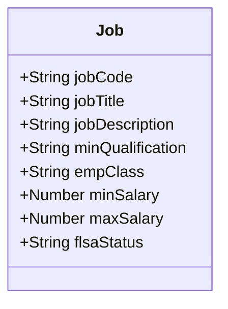
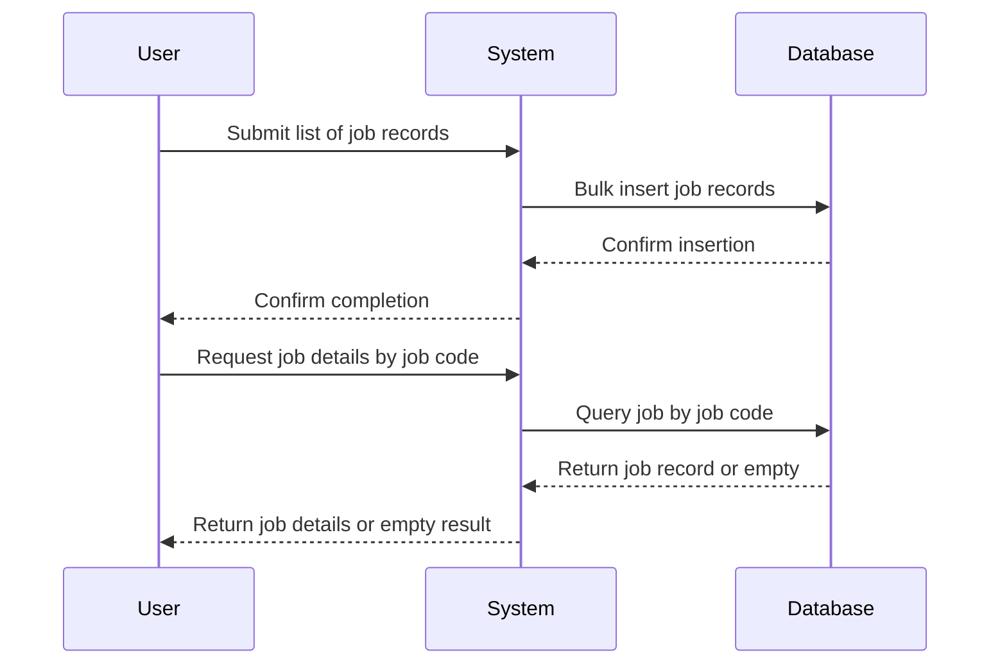
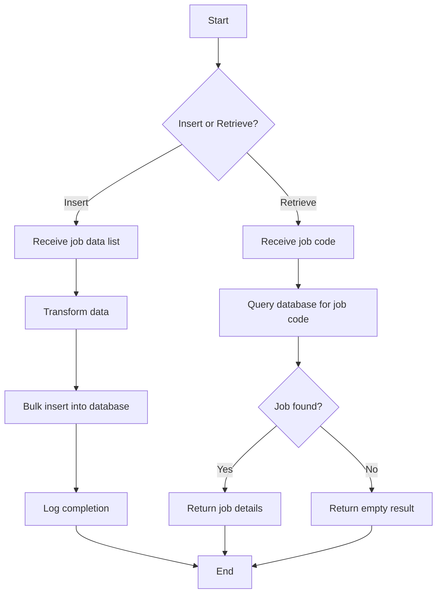

# explain about this document

This document describes the business processes and rules for managing job records within the application. It covers how job data is inserted and retrieved, focusing on the business context and operational flows. The goal is to clarify what the system does from a business perspective, without technical jargon, to support stakeholders in understanding and validating the application behavior.

We will cover:

1. How job records are added to the system.
2. How job records are retrieved based on job codes.
3. The business rules governing these operations.
4. Validation rules ensuring data correctness.
5. Entities involved and their attributes.
6. Integration points relevant to job management.
7. Dependencies between use cases.

# introduction

| Aspect              | Description                                                                                                    |
| ------------------- | -------------------------------------------------------------------------------------------------------------- |
| Application purpose | Manage job information including creation and retrieval of job records.                                        |
| Business context    | Supports HR and administrative functions by maintaining job details such as title, salary, and classification. |
| Objectives          | Enable bulk insertion of job data and retrieval of specific job details by job code.                           |

# UC-001 | Insert job records

| Description    | Allows bulk insertion of multiple job records into the system. |
| -------------- | -------------------------------------------------------------- |
| Primary Actor  | HR Administrator, Data Import System                           |
| Preconditions  | Job data to be inserted is available and formatted correctly.  |
| Postconditions | Job records are stored and available for retrieval.            |

## Basic flow

| Step | User actions                            | System actions                                   |
| ---- | --------------------------------------- | ------------------------------------------------ |
| 1    | Provide a list of job records to insert | Transform input data into database insert format |
| 2    | Confirm data submission                 | Perform bulk insert of job records into storage  |
| 3    | Receive confirmation                    | Log completion of data insertion                 |

## Alternate flow

| Step | User actions                            | System actions                                       |
| ---- | --------------------------------------- | ---------------------------------------------------- |
| 1    | Provide partial or incremental job data | System processes only provided records for insertion |

## Exception flow

| Step | User actions                                   | System actions                                   |
| ---- | ---------------------------------------------- | ------------------------------------------------ |
| 1    | Submit malformed or incomplete job data        | Reject insertion and log error                   |
| 2    | Attempt insertion when database is unavailable | Return failure message and retry logic triggered |

## Business rules

| Rule ID | Description                                                                                                                    |
| ------- | ------------------------------------------------------------------------------------------------------------------------------ |
| BR-001  | Job records must include job code, title, description, minimum qualification, employment class, salary range, and FLSA status. |
| BR-002  | Bulk insertion allows multiple job records to be added in a single operation.                                                  |

## Validation rules

| Rule ID | Description                                                       |
| ------- | ----------------------------------------------------------------- |
| VR-001  | Job code must be unique and non-empty.                            |
| VR-002  | Salary fields must be numeric and minSalary ≤ maxSalary.          |
| VR-003  | Employment class and FLSA status must be valid predefined values. |

## Entities and data model

| Entity | Attributes       | Description                                 | Constraints / Validation  | Error messages on validation failure                              |
| ------ | ---------------- | ------------------------------------------- | ------------------------- | ----------------------------------------------------------------- |
| Job    | jobCode          | Unique identifier for the job               | Must be unique, non-empty | "Job code is required and must be unique."                        |
|        | jobTitle         | Name of the job                             | Non-empty                 | "Job title cannot be empty."                                      |
|        | jobDescription   | Description of job responsibilities         | Optional                  |                                                                   |
|        | minQualification | Minimum qualification required              | Non-empty                 | "Minimum qualification is required."                              |
|        | empClass         | Employment classification (e.g., full-time) | Must be from allowed set  | "Employment class is invalid."                                    |
|        | minSalary        | Minimum salary for the job                  | Numeric, ≤ maxSalary      | "Minimum salary must be less than or equal to maximum salary."    |
|        | maxSalary        | Maximum salary for the job                  | Numeric, ≥ minSalary      | "Maximum salary must be greater than or equal to minimum salary." |
|        | flsaStatus       | Fair Labor Standards Act status             | Must be from allowed set  | "FLSA status is invalid."                                         |

## Validation and testing

| Acceptance criteria                                | Test scenarios                    | Edge cases                          | Validation rules tested | Sample test data                               |
| -------------------------------------------------- | --------------------------------- | ----------------------------------- | ----------------------- | ---------------------------------------------- |
| Bulk insert completes successfully with valid data | Insert multiple valid job records | Empty job list, duplicate job codes | VR-001, VR-002, VR-003  | List of jobs with valid attributes             |
| System rejects invalid job data                    | Insert job with missing jobCode   | minSalary > maxSalary               | VR-001, VR-002          | Job with missing jobCode, invalid salary range |

# UC-002 | Retrieve job record by job code

| Description    | Allows retrieval of a single job record by specifying its unique job code. |
| -------------- | -------------------------------------------------------------------------- |
| Primary Actor  | HR Administrator, Employee, System Integration                             |
| Preconditions  | The job record with the specified job code exists in the system.           |
| Postconditions | The job details are returned to the requester.                             |

## Basic flow

| Step | User actions               | System actions                               |
| ---- | -------------------------- | -------------------------------------------- |
| 1    | Provide job code to search | Construct query to find job by job code      |
| 2    | Request job details        | Retrieve job record matching job code        |
| 3    | Receive job details        | Return job data or empty result if not found |

## Alternate flow

| Step | User actions                         | System actions                                     |
| ---- | ------------------------------------ | -------------------------------------------------- |
| 1    | Request job code that does not exist | Return empty result or indication of no data found |

## Exception flow

| Step | User actions                          | System actions                       |
| ---- | ------------------------------------- | ------------------------------------ |
| 1    | Provide invalid or malformed job code | Return error or empty result         |
| 2    | Database connection failure           | Return error message and log failure |

## Business rules

| Rule ID | Description                                                                |
| ------- | -------------------------------------------------------------------------- |
| BR-003  | Job retrieval is based solely on the unique job code provided.             |
| BR-004  | If no job matches the job code, an empty result is returned without error. |

## Validation rules

| Rule ID | Description                                                    |
| ------- | -------------------------------------------------------------- |
| VR-004  | Job code must be provided and non-empty.                       |
| VR-005  | Job code must conform to expected format (e.g., alphanumeric). |

## Entities and data model

| Entity | Attributes       | Description                         | Constraints / Validation | Error messages on validation failure |
| ------ | ---------------- | ----------------------------------- | ------------------------ | ------------------------------------ |
| Job    | jobCode          | Unique identifier for the job       | Must be non-empty        | "Job code is required."              |
|        | jobTitle         | Name of the job                     | N/A                      |                                      |
|        | jobDescription   | Description of job responsibilities | N/A                      |                                      |
|        | minQualification | Minimum qualification required      | N/A                      |                                      |
|        | empClass         | Employment classification           | N/A                      |                                      |
|        | minSalary        | Minimum salary for the job          | N/A                      |                                      |
|        | maxSalary        | Maximum salary for the job          | N/A                      |                                      |
|        | flsaStatus       | Fair Labor Standards Act status     | N/A                      |                                      |

## Validation and testing

| Acceptance criteria                                   | Test scenarios                         | Edge cases                            | Validation rules tested | Sample test data                 |
| ----------------------------------------------------- | -------------------------------------- | ------------------------------------- | ----------------------- | -------------------------------- |
| Retrieve job details successfully with valid job code | Query existing job code                | Non-existent job code, empty job code | VR-004, VR-005          | Valid job code strings           |
| Handle missing or invalid job code gracefully         | Query with empty or malformed job code | Database errors                       | VR-004, VR-005          | Empty string, special characters |

# business rules summary

| Use Case | Rule ID | Description                                                                                                                    | Conditions                           |
| -------- | ------- | ------------------------------------------------------------------------------------------------------------------------------ | ------------------------------------ |
| UC-001   | BR-001  | Job records must include job code, title, description, minimum qualification, employment class, salary range, and FLSA status. | Applies to all job insertions        |
| UC-001   | BR-002  | Bulk insertion allows multiple job records to be added in a single operation.                                                  | Applies when inserting multiple jobs |
| UC-002   | BR-003  | Job retrieval is based solely on the unique job code provided.                                                                 | Applies to all job retrievals        |
| UC-002   | BR-004  | If no job matches the job code, an empty result is returned without error.                                                     | Applies when job code not found      |

# integration requirements

| Integration Aspect     | Description                                                                            |
| ---------------------- | -------------------------------------------------------------------------------------- |
| Data exchange format   | JSON format is used for input and output of job data.                                  |
| Communication protocol | Internal system flows handle data transformation and database operations.              |
| External systems       | Integration with database system for storing and retrieving job records.               |
| Bulk operations        | Supports bulk insertion of job data to optimize performance during large data imports. |

# use case dependencies

|                                 | Insert job records | Retrieve job record by job code |
| :-----------------------------: | :----------------: | :-----------------------------: |
|        Insert job records       |          X         |                                 |
| Retrieve job record by job code |                    |                X                |

# use case to entity dependencies

| Use Case                        | Job Entity |
| :------------------------------ | :--------: |
| Insert job records              |      X     |
| Retrieve job record by job code |      X     |

# diagrams

<SwmMeta version="3.0.0" repo-id="Z2l0aHViJTNBJTNBbXVsZS1kZW1vLWRhdGFiYXNlLWFwcCUzQSUzQXVtYWxpbmdhc3dhbWk=" repo-name="mule-demo-database-app">Powered by [Swimm](https://app.swimm.io/)</SwmMeta>
