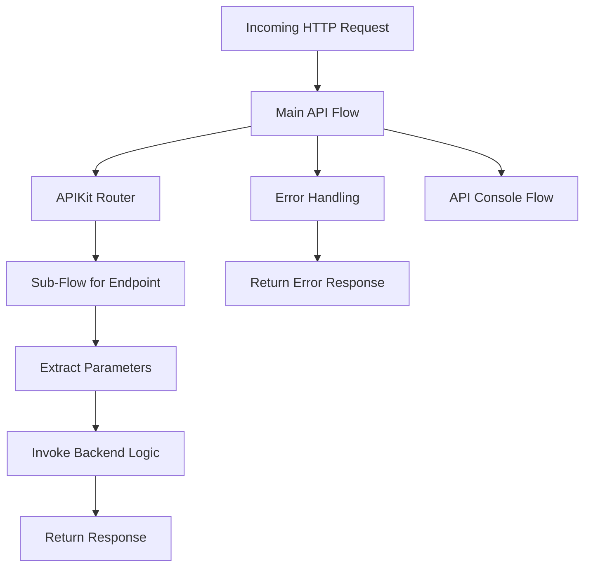

# Overview of Integration Flows in the API Layer

Integration flows in the API layer define the structured process by which incoming HTTP requests are received, routed, and handled to produce appropriate responses. These flows encapsulate the entire lifecycle of an API request, from listening on specified endpoints to invoking backend business logic and managing errors.

# Main API Flow and Request Routing

At the core of the API layer is the main API flow, which listens for HTTP requests on configured paths such as '<SwmPath>[src/…/resources/api/](src/main/resources/api/)</SwmPath>\*'. This flow uses an APIKit router to direct incoming requests to specific sub-flows based on the API configuration. The router ensures that each request is routed to the correct endpoint handler, enabling modular and maintainable API design.

# Sub-Flows for Endpoint Handling

Each sub-flow corresponds to a particular API endpoint and is responsible for extracting parameters from the incoming request, such as path variables or query parameters. After parameter extraction, the sub-flow invokes the relevant backend business logic flow to process the request. For example, the sub-flow handling 'get:/employee/{empId}:<SwmToken path="src/main/mule/api.xml" pos="13:11:13" line-data="        &lt;apikit:router config-ref=&quot;api-config&quot; /&gt;">`api-config`</SwmToken>' extracts the <SwmToken path="src/main/mule/api.xml" pos="122:12:12" line-data="    &lt;flow name=&quot;get:\employee\(empId):api-config&quot;&gt;">`empId`</SwmToken> parameter and calls the <SwmToken path="src/main/mule/api.xml" pos="128:11:11" line-data="		&lt;flow-ref doc:name=&quot;employeeGet&quot; doc:id=&quot;20d66a4d-dcff-40d9-81a9-9ef640322b2a&quot; name=&quot;employeeGet&quot;/&gt;">`employeeGet`</SwmToken> flow to retrieve employee data.

# Centralized Error Handling

Error handling is centralized within the main API flow to provide consistent and standardized responses for common HTTP errors. This includes handling bad requests, resource not found errors, method not allowed, and unsupported media types. The error handlers return JSON-formatted messages with appropriate HTTP status codes, improving client-side error interpretation and debugging.

# API Console Flow for Interactive Testing

In addition to request processing flows, the integration includes a console flow that serves the API console interface. This interface allows developers and testers to interactively explore and test the API endpoints, facilitating easier development and debugging.

# Benefits of Using Integration Flows

Integration flows provide a modular and organized approach to managing API request processing. They enable clear separation of concerns by isolating routing, parameter extraction, business logic invocation, and error handling. This modularity enhances maintainability, scalability, and consistency across the API layer.

# How to Implement Integration Flows

To implement integration flows, start by defining a main flow that listens on the desired HTTP paths. Incorporate an APIKit router within this flow to route requests to sub-flows based on the API specification. Each sub-flow should handle parameter extraction and invoke the corresponding backend logic flow. Finally, implement centralized error handlers in the main flow to manage common HTTP errors with standardized JSON responses.

<SwmSnippet path="/src/main/mule/api.xml" line="3">

---

The <SwmToken path="src/main/mule/api.xml" pos="3:7:9" line-data="    &lt;flow name=&quot;api-main&quot;&gt;">`api-main`</SwmToken> flow listens on the '<SwmPath>[src/…/resources/api/](src/main/resources/api/)</SwmPath>\*' path and uses the APIKit router to route requests. For instance, the sub-flow 'get:/employee/{empId}:<SwmToken path="src/main/mule/api.xml" pos="13:11:13" line-data="        &lt;apikit:router config-ref=&quot;api-config&quot; /&gt;">`api-config`</SwmToken>' extracts the <SwmToken path="src/main/mule/api.xml" pos="122:12:12" line-data="    &lt;flow name=&quot;get:\employee\(empId):api-config&quot;&gt;">`empId`</SwmToken> parameter from the URI and calls the <SwmToken path="src/main/mule/api.xml" pos="128:11:11" line-data="		&lt;flow-ref doc:name=&quot;employeeGet&quot; doc:id=&quot;20d66a4d-dcff-40d9-81a9-9ef640322b2a&quot; name=&quot;employeeGet&quot;/&gt;">`employeeGet`</SwmToken> flow to fetch employee details. The main flow also includes error handlers that return JSON messages with appropriate HTTP status codes for errors such as bad requests or resource not found.

```xml
    <flow name="api-main">
        <http:listener config-ref="api-httpListenerConfig" path="/api/*">
            <http:response statusCode="#[vars.httpStatus default 200]">
                <http:headers>#[vars.outboundHeaders default {}]</http:headers>
            </http:response>
            <http:error-response statusCode="#[vars.httpStatus default 500]">
                <http:body>#[payload]</http:body>
                <http:headers>#[vars.outboundHeaders default {}]</http:headers>
            </http:error-response>
        </http:listener>
        <apikit:router config-ref="api-config" />
        <error-handler>
            <on-error-propagate type="APIKIT:BAD_REQUEST">
                <ee:transform xmlns:ee="http://www.mulesoft.org/schema/mule/ee/core" xsi:schemaLocation="http://www.mulesoft.org/schema/mule/ee/core http://www.mulesoft.org/schema/mule/ee/core/current/mule-ee.xsd">
                    <ee:message>
                        <ee:set-payload><![CDATA[%dw 2.0
output application/json
---
{message: "Bad request"}]]></ee:set-payload>
                    </ee:message>
                    <ee:variables>
                        <ee:set-variable variableName="httpStatus">400</ee:set-variable>
                    </ee:variables>
                </ee:transform>
            </on-error-propagate>
            <on-error-propagate type="APIKIT:NOT_FOUND">
                <ee:transform xmlns:ee="http://www.mulesoft.org/schema/mule/ee/core" xsi:schemaLocation="http://www.mulesoft.org/schema/mule/ee/core http://www.mulesoft.org/schema/mule/ee/core/current/mule-ee.xsd">
                    <ee:message>
                        <ee:set-payload><![CDATA[%dw 2.0
output application/json
---
{message: "Resource not found"}]]></ee:set-payload>
                    </ee:message>
                    <ee:variables>
                        <ee:set-variable variableName="httpStatus">404</ee:set-variable>
                    </ee:variables>
                </ee:transform>
            </on-error-propagate>
            <on-error-propagate type="APIKIT:METHOD_NOT_ALLOWED">
                <ee:transform xmlns:ee="http://www.mulesoft.org/schema/mule/ee/core" xsi:schemaLocation="http://www.mulesoft.org/schema/mule/ee/core http://www.mulesoft.org/schema/mule/ee/core/current/mule-ee.xsd">
                    <ee:message>
                        <ee:set-payload><![CDATA[%dw 2.0
output application/json
---
{message: "Method not allowed"}]]></ee:set-payload>
                    </ee:message>
                    <ee:variables>
                        <ee:set-variable variableName="httpStatus">405</ee:set-variable>
                    </ee:variables>
                </ee:transform>
            </on-error-propagate>
            <on-error-propagate type="APIKIT:NOT_ACCEPTABLE">
                <ee:transform xmlns:ee="http://www.mulesoft.org/schema/mule/ee/core" xsi:schemaLocation="http://www.mulesoft.org/schema/mule/ee/core http://www.mulesoft.org/schema/mule/ee/core/current/mule-ee.xsd">
                    <ee:message>
                        <ee:set-payload><![CDATA[%dw 2.0
output application/json
---
{message: "Not acceptable"}]]></ee:set-payload>
                    </ee:message>
                    <ee:variables>
                        <ee:set-variable variableName="httpStatus">406</ee:set-variable>
                    </ee:variables>
                </ee:transform>
            </on-error-propagate>
            <on-error-propagate type="APIKIT:UNSUPPORTED_MEDIA_TYPE">
                <ee:transform xmlns:ee="http://www.mulesoft.org/schema/mule/ee/core" xsi:schemaLocation="http://www.mulesoft.org/schema/mule/ee/core http://www.mulesoft.org/schema/mule/ee/core/current/mule-ee.xsd">
                    <ee:message>
                        <ee:set-payload><![CDATA[%dw 2.0
output application/json
---
{message: "Unsupported media type"}]]></ee:set-payload>
                    </ee:message>
                    <ee:variables>
                        <ee:set-variable variableName="httpStatus">415</ee:set-variable>
                    </ee:variables>
                </ee:transform>
            </on-error-propagate>
            <on-error-propagate type="APIKIT:NOT_IMPLEMENTED">
                <ee:transform xmlns:ee="http://www.mulesoft.org/schema/mule/ee/core" xsi:schemaLocation="http://www.mulesoft.org/schema/mule/ee/core http://www.mulesoft.org/schema/mule/ee/core/current/mule-ee.xsd">
                    <ee:message>
                        <ee:set-payload><![CDATA[%dw 2.0
output application/json
---
{message: "Not Implemented"}]]></ee:set-payload>
                    </ee:message>
                    <ee:variables>
                        <ee:set-variable variableName="httpStatus">501</ee:set-variable>
                    </ee:variables>
                </ee:transform>
            </on-error-propagate>
        </error-handler>
    </flow>
```

---

</SwmSnippet>



&nbsp;

*This is an auto-generated document by Swimm 🌊 and has not yet been verified by a human*

<SwmMeta version="3.0.0" repo-id="Z2l0aHViJTNBJTNBbXVsZS1kZW1vLWRhdGFiYXNlLWFwcCUzQSUzQXVtYWxpbmdhc3dhbWk=" repo-name="mule-demo-database-app"><sup>Powered by [Swimm](https://app.swimm.io/)</sup></SwmMeta>
