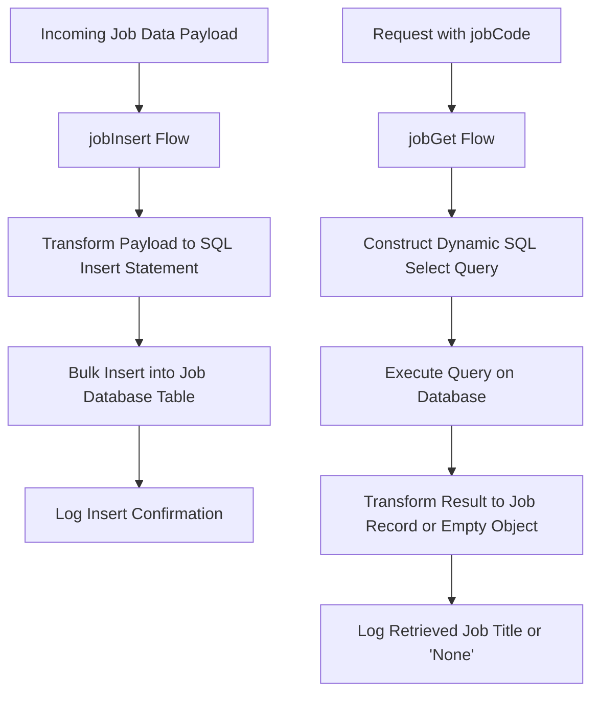

# Overview of Job Data Integration

Job Data Integration in this application refers to the process of managing job-related data by inserting and retrieving records through Mule flows that interact with the database. This integration enables efficient handling of job records by performing bulk insertions and selective queries.

# Implementation in Mule Flows

The integration is implemented within the Mule flows defined in the <SwmPath>[src/…/mule/job.xml](src/main/mule/job.xml)</SwmPath> file. Two primary flows handle the job data operations: `jobInsert` for inserting job records and `jobGet` for retrieving job details.

# The jobInsert Flow

The `jobInsert` flow processes incoming job data payloads by transforming them into a format suitable for bulk insertion into the job database table. It constructs an SQL insert statement and maps each job attribute from the payload to the corresponding database columns. This mapping allows the flow to execute a bulk-insert operation, efficiently adding multiple job records in a single database transaction. After the insertion completes, a logger outputs a confirmation message indicating the successful data insert operation.

# The jobGet Flow

The `jobGet` flow retrieves job data by dynamically constructing an SQL select query based on a provided `jobCode` variable. It executes this query against the database and transforms the result to return the first matching job record. If no matching record is found, it returns an empty object. Additionally, a logger outputs a message indicating the job title of the retrieved record or 'None' if no data was found.

# Data Flow Summary

Together, these flows enable the application to efficiently manage job data by handling bulk inserts and targeted retrievals. The `jobInsert` flow ensures that multiple job records can be added in one operation, improving performance, while the `jobGet` flow provides precise access to job details based on job codes.

&nbsp;

*This is an auto-generated document by Swimm 🌊 and has not yet been verified by a human*

<SwmMeta version="3.0.0" repo-id="Z2l0aHViJTNBJTNBbXVsZS1kZW1vLWRhdGFiYXNlLWFwcCUzQSUzQXVtYWxpbmdhc3dhbWk=" repo-name="mule-demo-database-app">Powered by [Swimm](https://app.swimm.io/)</SwmMeta>
