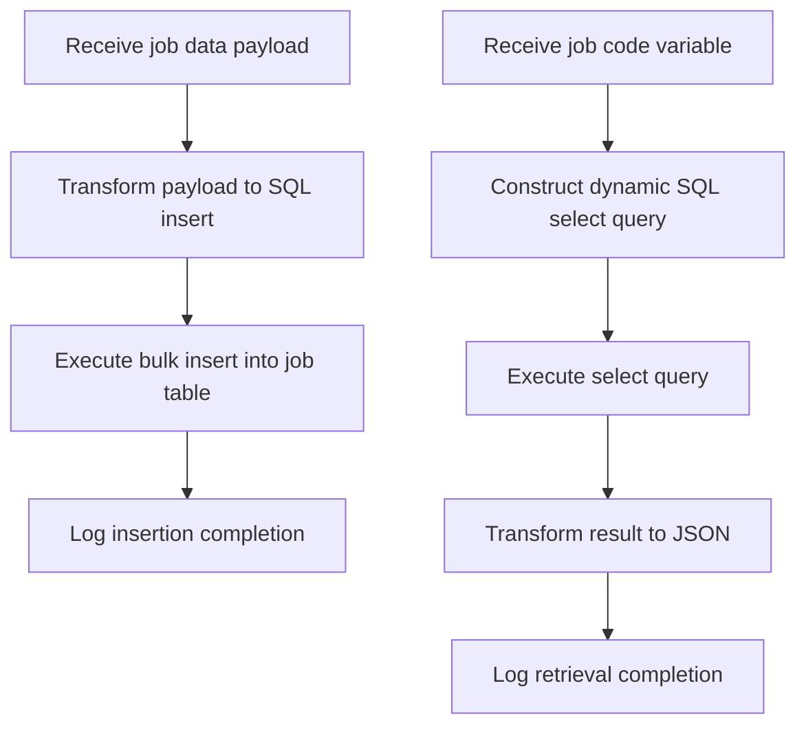

# Introduction to Job Management Core Flows

Job Management Core encompasses the Mule flows defined in the <SwmPath>[src/…/mule/job.xml](src/main/mule/job.xml)</SwmPath> file that manage essential operations related to job data within the application. These flows are responsible for inserting new job records into the database and retrieving job details based on a unique job code.

# Core Flows Overview

The two primary flows in Job Management Core are `jobInsert` and `jobGet`. The `jobInsert` flow handles the transformation of incoming payloads into SQL insert statements and performs bulk inserts into the job table, enabling efficient batch processing of job data. Conversely, the `jobGet` flow dynamically constructs a SQL select query using a job code variable, retrieves the corresponding job record from the database, and transforms the result into a JSON response.

# Purpose and Usage

These flows ensure consistent and performant processing of job data by transforming input payloads into SQL queries and interacting with the database. The `jobInsert` flow is used when new job data needs to be added in bulk, while the `jobGet` flow is invoked to fetch job details for a specific job code.

# How to Use Job Management Core Flows

To insert job data, provide a payload containing job details to the `jobInsert` flow. This flow maps the payload to a bulk insert SQL statement and executes it against the database. To retrieve job information, set the job code variable and invoke the `jobGet` flow, which builds a select query dynamically and returns the matching job record as a JSON object.

# Implementation Location

Both `jobInsert` and `jobGet` flows are implemented in the <SwmPath>[src/…/mule/job.xml](src/main/mule/job.xml)</SwmPath> file. This centralizes job data operations and facilitates maintenance and enhancements.

# Logging and Monitoring

Logging is integrated into both flows to provide informational messages upon completion of data insertion and retrieval operations. This helps in monitoring the flow executions and troubleshooting if necessary.

# Example Usage

In the `jobInsert` flow, the incoming payload is transformed into a SQL insert statement with parameters corresponding to job attributes, followed by a bulk insert operation into the job table. In the `jobGet` flow, a select query is constructed using the provided job code variable, executed to fetch the matching record, and the first result is transformed into a JSON response. Both flows conclude with logging statements indicating successful operation completion.

&nbsp;

*This is an auto-generated document by Swimm 🌊 and has not yet been verified by a human*

<SwmMeta version="3.0.0" repo-id="Z2l0aHViJTNBJTNBbXVsZS1kZW1vLWRhdGFiYXNlLWFwcCUzQSUzQXVtYWxpbmdhc3dhbWk=" repo-name="mule-demo-database-app">Powered by [Swimm](https://app.swimm.io/)</SwmMeta>
