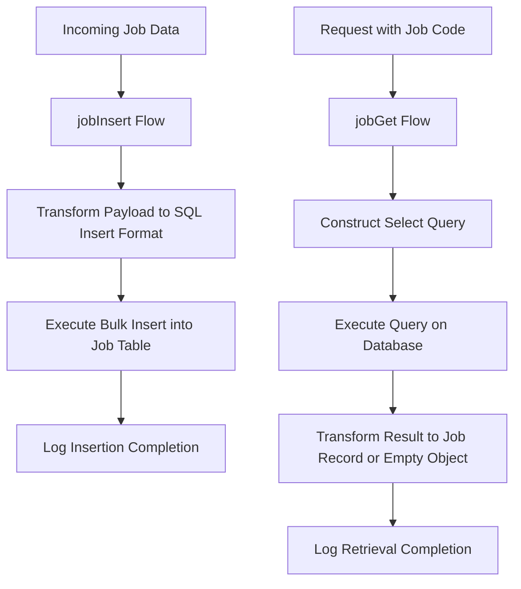

# Job Management Overview

Job Management in this application involves handling job-related data stored in the database. It primarily focuses on managing job records through operations such as inserting new job entries and retrieving existing job details based on specific criteria.

# Inserting Job Records

The `jobInsert` flow is designed to process incoming job data by transforming the payload into a format suitable for bulk insertion into the job table. This flow constructs an SQL insert statement where each job attribute from the payload is mapped to the corresponding database column. After transformation, it executes a bulk insert operation, which efficiently adds multiple job records in a single transaction.

# Retrieving Job Details

The `jobGet` flow handles the retrieval of job details by constructing a select query using a provided job code. It executes this query against the database and transforms the result to return either the matching job record or an empty object if no matching job is found. This ensures that the application can fetch specific job information on demand.

# Logging in Job Management

Both `jobInsert` and `jobGet` flows incorporate logging steps that provide informational messages about the completion of their respective operations. This logging facilitates monitoring and debugging by confirming successful data insertion and retrieval activities.

# Example Usage

For example, in the file <SwmPath>[src/…/mule/job.xml](src/main/mule/job.xml)</SwmPath>, the `jobInsert` flow transforms a list of job objects into a bulk insert SQL statement and executes it to add multiple job records efficiently. Similarly, the `jobGet` flow constructs a select query using a `jobCode` variable to fetch a specific job record from the database.

&nbsp;

*This is an auto-generated document by Swimm 🌊 and has not yet been verified by a human*

<SwmMeta version="3.0.0" repo-id="Z2l0aHViJTNBJTNBbXVsZS1kZW1vLWRhdGFiYXNlLWFwcCUzQSUzQXVtYWxpbmdhc3dhbWk=" repo-name="mule-demo-database-app">Powered by [Swimm](https://app.swimm.io/)</SwmMeta>
