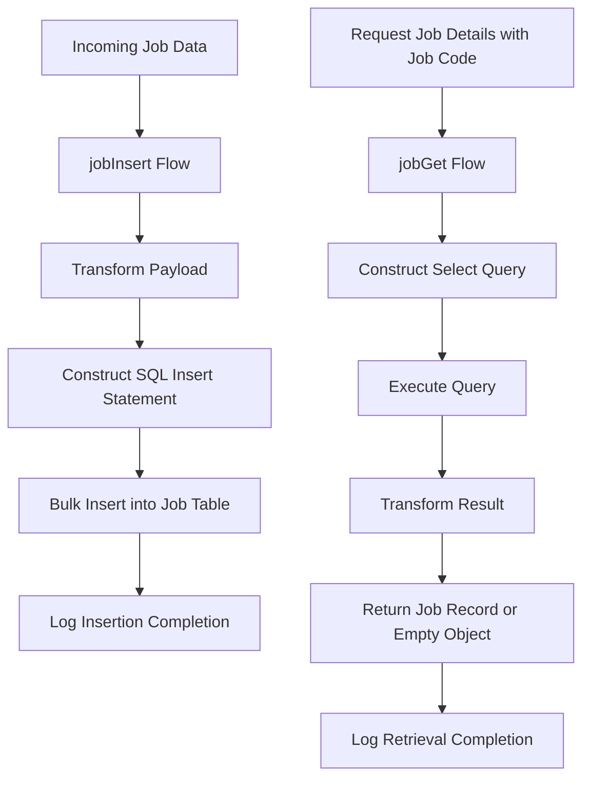

# Job Management Overview

Job Management in this application focuses on handling job-related data through database interactions. It primarily involves managing job records by inserting new entries and retrieving existing job details based on specific job codes.

## Core Flows for Job Management

The application implements two main Mule flows to manage job data: `jobInsert` and `jobGet`. These flows handle the transformation of incoming data and execution of SQL operations to maintain job records in the database.

## The jobInsert Flow

The `jobInsert` flow is responsible for processing incoming job data. It transforms the payload into a format suitable for bulk insertion by mapping each job attribute to the corresponding database column. This flow constructs an SQL insert statement and executes a bulk insert operation to efficiently add multiple job records to the job table.

## The jobGet Flow

The `jobGet` flow retrieves job information by dynamically constructing a select query using a job code variable. It executes this query against the database to fetch matching job records. After retrieval, the flow transforms the result to return either a single job record or an empty object if no matching job is found.

## Logging and Monitoring

Both `jobInsert` and `jobGet` flows incorporate logging to provide informational messages. These logs indicate the successful completion of data insertion and retrieval operations, aiding in monitoring and troubleshooting.

## Importance of Job Management

Efficient job data management is vital for supporting application features that rely on accurate and up-to-date job information, such as job listings and detail retrieval. The flows ensure data integrity and performance by using bulk operations and precise queries.

## Data Flow Summary

Incoming job data enters the `jobInsert` flow where it is transformed and bulk inserted into the database. When job details are requested, the `jobGet` flow constructs a query using the job code, retrieves the data, and returns a formatted response. Logging throughout these processes ensures transparency and aids in debugging.

&nbsp;

*This is an auto-generated document by Swimm 🌊 and has not yet been verified by a human*

<SwmMeta version="3.0.0" repo-id="Z2l0aHViJTNBJTNBbXVsZS1kZW1vLWRhdGFiYXNlLWFwcCUzQSUzQXVtYWxpbmdhc3dhbWk=" repo-name="mule-demo-database-app">Powered by [Swimm](https://app.swimm.io/)</SwmMeta>
