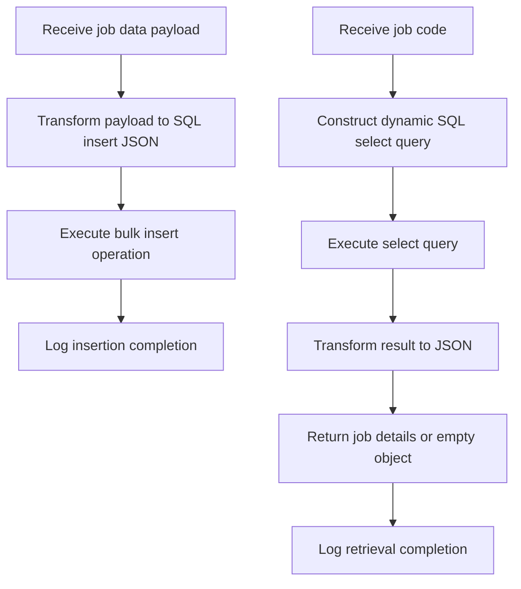

# Overview of Job Processing

Job Processing in the Job Management module involves managing job-related data operations such as inserting new job records and retrieving existing job details. This functionality ensures that job information is accurately stored and accessible within the system.

# Inserting Job Records

The insertion of job records is handled through a bulk insert operation. Incoming payload data is mapped to specific database fields including job code, title, description, qualifications, employee class, salary range, and status. This mapping facilitates efficient insertion of multiple job entries in a single database operation, improving performance and consistency.

# Retrieving Job Details

To retrieve job information, the system dynamically constructs a SQL SELECT query using the provided job code. This query is executed against the database to fetch the matching job record. The dynamic construction allows flexible querying based on different job codes supplied at runtime.

# Data Transformation and Output Formatting

After retrieving job data, the result undergoes transformation to ensure a consistent JSON output format. If no matching job is found, the system returns an empty JSON object. This approach standardizes the response format for downstream processing or client consumption.

# Logging in Job Processing Flows

Logging is integrated into the job processing flows to provide clear informational messages. These logs indicate successful completion of data insertion and retrieval operations, aiding in monitoring and troubleshooting.

<SwmSnippet path="/src/main/mule/job.xml" line="11">

---

Job Processing is implemented in two primary Mule flows defined in <SwmPath>[src/…/mule/job.xml](src/main/mule/job.xml)</SwmPath>: <SwmToken path="src/main/mule/job.xml" pos="11:7:7" line-data="	&lt;flow name=&quot;jobInsert&quot; doc:id=&quot;e136c434-10be-4b46-8043-57344343ccaa&quot; &gt;">`jobInsert`</SwmToken> and <SwmToken path="src/main/mule/job.xml" pos="40:7:7" line-data="	&lt;flow name=&quot;jobGet&quot; doc:id=&quot;ff4dc4f5-8532-4493-a569-cbfd448e8da4&quot; &gt;">`jobGet`</SwmToken>. The <SwmToken path="src/main/mule/job.xml" pos="11:7:7" line-data="	&lt;flow name=&quot;jobInsert&quot; doc:id=&quot;e136c434-10be-4b46-8043-57344343ccaa&quot; &gt;">`jobInsert`</SwmToken> flow handles bulk insertion of job data, transforming the incoming payload into a JSON structure containing the SQL insert query and mapped job data list. This structure is then passed to a bulk insert database operation. A logger confirms the successful insertion. The <SwmToken path="src/main/mule/job.xml" pos="40:7:7" line-data="	&lt;flow name=&quot;jobGet&quot; doc:id=&quot;ff4dc4f5-8532-4493-a569-cbfd448e8da4&quot; &gt;">`jobGet`</SwmToken> flow constructs and executes the dynamic SQL select query to retrieve job details by job code.

```xml
	<flow name="jobInsert" doc:id="e136c434-10be-4b46-8043-57344343ccaa" >
		<ee:transform doc:name="Transform Message" doc:id="096c0ad4-3f35-4cb9-b180-1bcbe2f73061" >
			<ee:message >
				<ee:set-payload ><![CDATA[%dw 2.0
output application/json
---
{
	query: "insert into job (jobCode,jobTitle,jobDescription,minQualification,empClass,minSalary,maxSalary,flsaStatus) 
			values (:jobCode,:jobTitle,:jobDescription,:minQualification,:empClass,:minSalary,:maxSalary,:flsaStatus)",
	body: payload map ( payload01 , indexOfPayload01 ) -> {
			jobCode: payload01.jobCode,
			jobTitle: payload01.jobTitle,
			jobDescription: payload01.jobDescription,
			minQualification: payload01.minQualification,
			empClass: payload01.empClass,
			minSalary: payload01.minSalary,
			maxSalary: payload01.maxSalary,
			flsaStatus: payload01.flsaStatus
	}
}]]></ee:set-payload>
			</ee:message>
		</ee:transform>
		<db:bulk-insert doc:name="Bulk insert" doc:id="8f2a4472-997e-45c9-8e21-1d6f39a4c4f4" config-ref="Database_Config">
			<db:bulk-input-parameters ><![CDATA[#[payload.body]]]></db:bulk-input-parameters>
			<db:sql ><![CDATA[#[payload.query]]]></db:sql>
		</db:bulk-insert>
		<logger level="INFO" doc:name="Logger" doc:id="dede0e83-c71b-443b-92ed-9d51fc74a1d0" message="Insert of Data Complete"/>
	</flow>
```

---

</SwmSnippet>

The <SwmToken path="src/main/mule/job.xml" pos="11:7:7" line-data="	&lt;flow name=&quot;jobInsert&quot; doc:id=&quot;e136c434-10be-4b46-8043-57344343ccaa&quot; &gt;">`jobInsert`</SwmToken> flow transforms the incoming payload into a JSON object with the SQL insert statement and a list of job data mapped to database fields. This JSON is then used in a bulk insert operation to efficiently add multiple job records. A logger component outputs a message confirming the insertion completion.



&nbsp;

*This is an auto-generated document by Swimm 🌊 and has not yet been verified by a human*

<SwmMeta version="3.0.0" repo-id="Z2l0aHViJTNBJTNBbXVsZS1kZW1vLWRhdGFiYXNlLWFwcCUzQSUzQXVtYWxpbmdhc3dhbWk=" repo-name="mule-demo-database-app"><sup>Powered by [Swimm](https://app.swimm.io/)</sup></SwmMeta>
