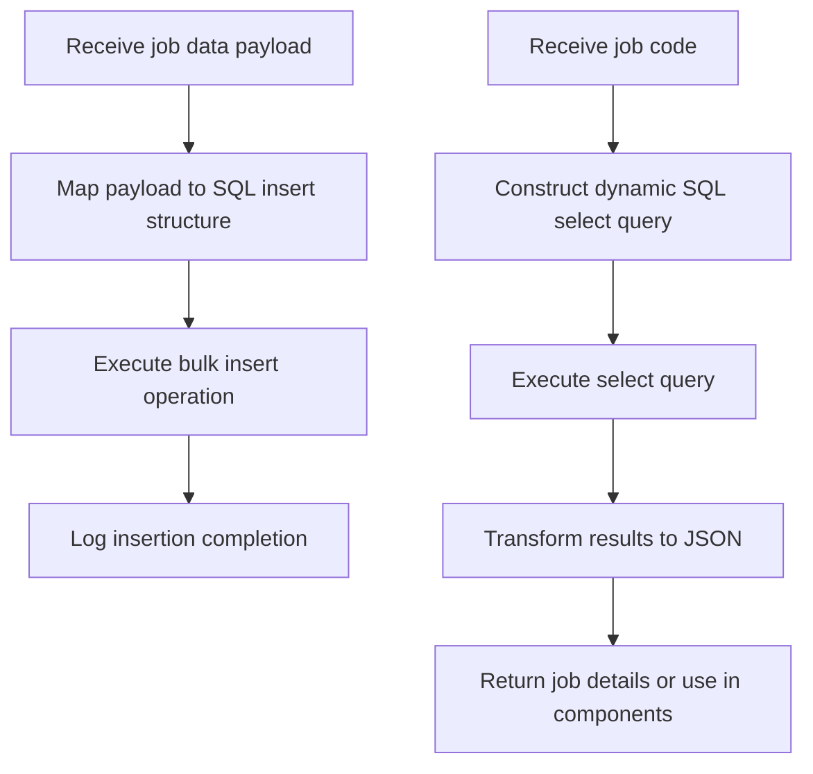

# Introduction to Job Processing

Job Processing in this application refers to managing job-related data operations, specifically focusing on inserting new job records into the database and retrieving existing job details using job codes. This functionality is essential for maintaining accurate and up-to-date job information within the system.

# Purpose of Job Processing

The primary purpose of Job Processing is to efficiently handle job data by enabling bulk insertion of multiple job records simultaneously and dynamic retrieval of job information based on specific job codes. This approach enhances performance by reducing database transaction overhead and ensures data consistency across the application.

# How Job Processing Works

Job Processing involves two main operations: inserting job records and retrieving job details. For insertion, incoming job data payloads are transformed into a structured format that maps each job's attributes to the corresponding database fields. This structured data is then used in a bulk insert operation, which inserts multiple job records in a single transaction. For retrieval, a SQL select query is dynamically constructed using the job code variable, executed against the database, and the resulting data is transformed into JSON format for further use or client response.

# Implementation in the Codebase

The Job Processing logic is implemented within two flows named 'jobInsert' and 'jobGet' located in the file <SwmPath>[src/…/mule/job.xml](src/main/mule/job.xml)</SwmPath>. The 'jobInsert' flow handles the bulk insertion of job records by mapping the payload to a JSON structure containing SQL insert queries and parameters, then executing a bulk insert operation. The 'jobGet' flow constructs and executes a dynamic SQL query to retrieve job details based on a provided job code, then converts the results into JSON format.

# Logging and Feedback

Both insertion and retrieval operations include logging mechanisms that provide informational messages upon completion. These logs help track the success of data operations and assist in debugging or monitoring the job processing workflows.

# Example Usage of Job Processing

In the 'jobInsert' flow, the application receives a payload containing multiple job entries. This payload is mapped into a JSON structure that specifies SQL insert statements and their parameters for each job. The bulk insert operation then processes this structure, inserting all job records in one database transaction. After the operation completes, a logger outputs a confirmation message indicating successful data insertion.

&nbsp;

*This is an auto-generated document by Swimm 🌊 and has not yet been verified by a human*

<SwmMeta version="3.0.0" repo-id="Z2l0aHViJTNBJTNBbXVsZS1kZW1vLWRhdGFiYXNlLWFwcCUzQSUzQXVtYWxpbmdhc3dhbWk=" repo-name="mule-demo-database-app">Powered by [Swimm](https://app.swimm.io/)</SwmMeta>
